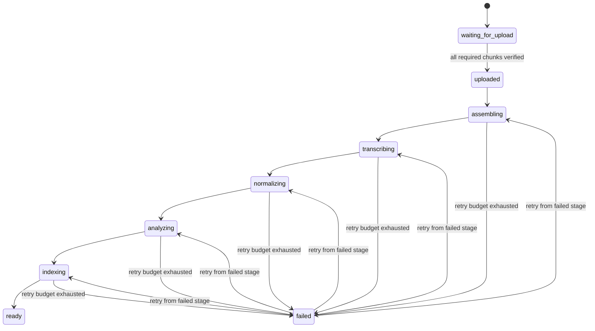

# Transcription, AI analysis, and processing pipeline

**Status:** Phase 0 design only. No provider SDK, worker, prompt, schema validator, migration, or AI call is implemented. Provider/model names remain configuration, not domain constants.

## 1. Canonical pipeline



Future phases may add a meeting lifecycle (`draft`, `recording`, `uploading`, `processing`, `ready`, `failed`, `archived`) distinct from pipeline state; **only `draft` exists in the Phase 1 migration**, and the remaining values are not active behavior. When recording/processing is authorized, the system must not enqueue transcription until the finalized manifest's required chunks are present and checksum-verified. Pipeline jobs are asynchronous; no single HTTP request waits for the full meeting pipeline.

## 2. Durable job execution and lease contract

Use PostgreSQL `processing_jobs` as the durable queue initially; do not add a broker/microservice before measurements justify it. Each row has a stable `idempotency_key` for `(meeting_id, stage, generation)`, status, `run_after`, `attempt_count`, `max_attempts`, `lease_owner` (unique worker/process instance ID), `lease_expires_at`, `heartbeat_at`, monotonically increasing `lease_fencing_token`, start/completion timestamps, and a redacted last-error code. A unique idempotency constraint prevents duplicate stage enqueue for the same generation; a partial unique constraint/index prevents multiple active jobs for the same logical stage/generation.

Job lifecycle:

```text
queued ──claim──> running ──success──> succeeded
                    │
                    ├──transient error──> retryable_failed ──run_after──> queued
                    ├──permanent error / attempts exhausted──> dead_lettered
                    └──authorized cancellation──> cancelled
running + expired lease ──reaper/reclaim──> retryable_failed or dead_lettered
```

**Atomic claim/concurrency rule:** in one short transaction, select eligible queued/retryable rows whose `run_after <= now()` (and, on reclaim, running rows whose lease expired), ordered by priority/time, using `SELECT ... FOR UPDATE SKIP LOCKED LIMIT n`. Update the selected row(s) with `status='running'`, this worker's `lease_owner`, `lease_expires_at`, `heartbeat_at`, incremented `attempt_count`, and a new fencing token; commit before doing network/provider work. A competing worker skips the locked row, so only one current lease is issued. A periodic reaper finds expired/stuck leases and makes them retryable or dead-lettered according to attempts. It never guesses success.

Long work heartbeats before lease expiry. Every heartbeat, result write, status transition, and final enqueue is conditional on matching `(job_id, lease_owner, lease_fencing_token)` and an unexpired lease. A stale worker that resumes after a pause/crash cannot commit after a newer worker owns the incremented fencing token. The lease prevents concurrent valid claims, not duplicate external calls: a timed-out provider call may still finish after reclamation, so outputs and external effects also require idempotency/reconciliation.

`attempt_count` increases per claim. Network failures, rate limits, provider unavailability, and recoverable storage errors enter `retryable_failed` with bounded exponential backoff plus jitter and a future `run_after`; invalid inputs/authorization/schema errors are permanent. When `max_attempts` is exhausted, move to `dead_lettered`, surface a redacted failure, and require an authorized user/operator retry. Automated attempts reuse the same job identity/key. A deliberate reprocess/retry after terminal failure creates a new generation/key and new analysis run, retaining the old attempt history. Cancellation is audited and fenced; it does not erase already committed outputs.

Each stage writes an immutable artifact or idempotent relational result, then transactionally advances state and enqueues the next job. External object storage, AssemblyAI, and OpenAI cannot participate in a PostgreSQL transaction: use deterministic storage keys/request fingerprints/provider request IDs, reconcile orphaned objects/runs, and make a retried stage detect already-committed artifacts. The guarantee is **at-least-once execution with idempotent effects**, not exactly-once external billing. Keep job payloads small and non-sensitive; source data is loaded using tenant-scoped identifiers and explicit workspace predicates.

`processing_events` is append-only and captures stage transitions, attempts, lease owner/fencing-token changes, durations, provider error category, and correlation IDs. Logs contain `workspace_id`, `meeting_id`, `recording_id`, and `job_id` where available, but not raw transcript/audio or secrets. See the corresponding columns/status domains in [database.md](database.md) and the worker privilege boundary in [security.md](security.md).

## 3. Stage contracts

| Stage                           | Preconditions                                                    | Work/output                                                                                                                                                      | Completion rule                                                                                         |
| ------------------------------- | ---------------------------------------------------------------- | ---------------------------------------------------------------------------------------------------------------------------------------------------------------- | ------------------------------------------------------------------------------------------------------- |
| `assemble_recording`            | Stop manifest finalized; all required source chunks verified     | Validate checksums/ranges, reconcile source timelines, create immutable derived provider input(s) with source manifest                                           | Every derived byte is traceable to original chunks; gaps are explicit                                   |
| `transcribe_meeting`            | Assembly artifact verified                                       | Call configured `TranscriptionProvider` with language hints and scoped custom vocabulary; persist provider run ID                                                | Normalized output is available or a classified retryable/permanent error is recorded                    |
| `normalize_transcript`          | Provider response stored/available                               | Map provider segments/speakers into stable internal IDs, validate times and text, preserve mixed language, create `transcript_segments` and speaker mapping rows | All segments have valid meeting-relative timestamps; provider raw shapes do not leak into domain tables |
| `analyze_meeting`               | Normalized transcript committed                                  | Evidence-window extraction, cross-window consolidation, typed summary/intelligence, evidence validation                                                          | Every publishable item/summary claim cites valid segments; no unknown owner/deadline is fabricated      |
| `generate_embeddings` / `index` | Canonical transcript/topics/intelligence and citations committed | Deterministic versioned knowledge chunks and embeddings                                                                                                          | Every vector row links to canonical source IDs and carries the current embedding model/version          |
| `finalize_meeting`              | Required preceding stages succeeded                              | Point meeting at current run, set ready, record completion event and enqueue notification                                                                        | Transaction ensures one active result generation; failure can resume from its failed stage              |
| `notify_user`                   | Meeting is ready                                                 | Optional later email/Telegram notification adapter                                                                                                               | Notification failure does not erase successful meeting data                                             |

`notify_user` is an optional post-ready job, not a reason to mark a successfully processed meeting failed. Whether indexing is blocking for `ready` is a policy decision; the initial contract follows the specified pipeline and treats successful indexing as required, with explicit retryable status when unavailable.

## 4. Transcription provider boundary

The domain sees only normalized types conceptually equivalent to:

```ts
interface TranscriptionProvider {
  transcribe(input: TranscriptionInput): Promise<NormalizedTranscript>;
}

interface NormalizedTranscript {
  provider: string;
  providerRunId: string | null;
  detectedLanguages: string[];
  segments: Array<{
    providerSegmentId: string | null;
    speakerKey: string | null; // stable per normalized meeting: speaker_0, speaker_1, …
    startMs: number; // canonical meeting-relative offset after timeline-map normalization
    endMs: number; // exclusive canonical meeting-relative offset
    text: string; // original words/code-switching, not translated
    language: string | null;
    confidence: number | null;
  }>;
}
```

### Provider-time normalization to the canonical meeting timeline

Every transcription request references an immutable input asset fingerprint and a persisted, versioned piecewise `asset_time → meeting_time → original_source_sample` map. This map is created when original chunks are assembled/rendered; it records which asset-local interval came from which canonical meeting interval and source sample range. If the provider receives a single mix that preserves meeting-time gaps, its map can be identity; if it receives per-source/per-chunk assets or a compressed concatenation, each interval must be mapped explicitly. The worker never infers the map from file duration.

The provider adapter first converts the provider's documented unit/time base (for example seconds from input-asset start) into exact asset-local sample/time offsets, then maps each `[asset_start, asset_end)` through the persisted map into canonical meeting-relative `[start_ms, end_ms)`. Store the resulting `NormalizedTranscript` times as canonical offsets; retain provider-local values only as diagnostic metadata. Reject offsets outside the submitted asset/map and do not clamp them. A segment crossing a discontinuity is split only when the mapping can preserve its text/evidence semantics; otherwise fail normalization for review. Persist canonical segment `start_ms` as the floor and exclusive `end_ms` as the ceiling of the mapped interval, using rational arithmetic before quantization. The versioned source map retains sample precision; playback maps the persisted canonical `start_ms` deterministically to the first decoded source sample at or after that point (and records any provider timestamp precision limit).

Thus `AI decision → evidence transcript segment → canonical start_ms → chunk/source sample` is deterministic and auditable. If several source tracks overlap, the evidence point resolves to the chosen original track or a rendered derivative whose manifest maps back to those tracks. See [recording.md](recording.md) for the clock and sample mapping contract.

The `AssemblyAITranscriptionProvider` owns AssemblyAI request/response/error mapping. Other adapters can be added without changing transcript entities. Provider speaker labels are normalized and then mapped to `meeting_speakers`; speaker renames never mutate segment text. Keep Uzbek/Russian/English code-switching as spoken. Custom terminology comes from workspace/company/project data at request time, not hard-coded dictionaries.

Transcription run metadata stores provider/model/version, input asset fingerprints, timestamps and redacted errors. Keep raw provider payload only when operationally necessary, access-controlled, retention-bounded, and out of ordinary application logs.

### Meeting-type analysis profiles

A workspace-scoped `meeting_types` row selects a versioned analysis profile; it changes emphasis, not evidence standards or the canonical output contract. The type is a configurable reference row, not a PostgreSQL enum, so built-in defaults and future workspace-defined types can coexist; see [database.md](database.md). Initial profile intent:

- `client_sales`: pain points, needs/goals, budget, authority/decision makers, timeline, objections, competitors, decision criteria and next steps.
- `marketing`: channels, audience, creative/tests, budgets, CPL/CPA/CAC/CTR/conversion, experiments, funnel and KPIs. Preserve the spoken value/unit and cite it; do not normalize a metric without evidence.
- `internal`: decisions, action owners/deadlines, blockers, dependencies and risks.
- `general`, `brainstorm`, `project_planning`, `interview`: use the common schema with appropriately scoped emphasis; no category may force an extraction when evidence is absent.

Profile keys/settings are versioned and selected from the authorized workspace meeting type. Custom vocabulary and profile hints are treated as data, safely delimited from system instructions, and cannot weaken uncertainty/evidence rules.

## 5. Immutable analysis-run versioning

Create an `analysis_runs` row before each result-producing provider execution. Retain at least `meeting_id`, workspace, exact input transcription-run/revision, provider, model, `prompt_version`, `schema_version`, pipeline/windowing version, reprocessing `generation`, `attempt_no`, optional `retry_of_run_id`, status, `started_at`, `completed_at`, and redacted error metadata. A deliberate reprocess (such as v1 → v3 after a prompt/model change) increments `generation`; a transient job retry preserves the processing-job idempotency key but creates a new analysis-run attempt linked to its predecessor if provider output may differ. A crash before any provider effect may resume a non-terminal run under its job lease/fencing contract. Once terminal, a run and its output rows are immutable; recovery never reopens or overwrites a failed historical run.

Every generated summary, claim, topic, typed intelligence item, and evidence relationship carries the producing `analysis_run_id`; no intelligence row is an unversioned meeting fact. Validate the complete candidate output and its evidence, then atomically point `meetings.current_analysis_run_id` to the accepted successful run. Until that transaction succeeds, the prior current accepted run remains active. An optional `latest_analysis_run_id` can point to the newest attempt, including failed/running, but is never a substitute for the current accepted pointer. Previous runs remain historically inspectable. If a product later maintains cross-run business facts, it must use explicit run/item lineage (for example `supersedes_item_id`) rather than silently copying facts into an unversioned table. Database pointer/FK rules are in [database.md](database.md).

## 6. Evidence-first AI contract

`MeetingIntelligenceProvider.analyze(...)` consumes only committed normalized segments plus meeting type configuration and explicitly marked user context. It returns a versioned, strict structured result; UI and persistence code never parse free-form Markdown as authoritative data.

Canonical result concept:

```ts
type EvidenceRef = { source_segment_ids: string[] }; // at least one valid ID

type EvidenceClaim = EvidenceRef & { text: string; confidence: number };

type MeetingAnalysis = {
  executive_summary: {
    purpose: string | null;
    overview: string;
    claims: EvidenceClaim[];
    unresolved: EvidenceClaim[];
  };
  topics: Array<
    EvidenceRef & {
      title: string;
      summary: string;
      keywords: string[];
      speaker_keys: string[];
      confidence: number;
    }
  >;
  decisions: Array<
    EvidenceRef & {
      title: string;
      description: string | null;
      speaker_key: string | null;
      status: 'proposed' | 'tentative' | 'confirmed' | 'rejected' | 'superseded';
      confidence: number;
    }
  >;
  action_items: Array<
    EvidenceRef & {
      title: string;
      description: string | null;
      owner_speaker_key: string | null;
      owner_text: string | null;
      deadline_iso: string | null;
      deadline_text: string | null;
      deadline_confidence: number | null;
      status: 'open';
      confidence: number;
    }
  >;
  facts: Array<
    EvidenceRef & {
      fact: string;
      category: string | null;
      value_text: string | null;
      value_number: number | null;
      unit: string | null;
      speaker_key: string | null;
      confidence: number;
    }
  >;
  ideas: Array<
    EvidenceRef & {
      title: string;
      description: string | null;
      speaker_key: string | null;
      confidence: number;
    }
  >;
  questions: Array<
    EvidenceRef & {
      question: string;
      speaker_key: string | null;
      status: 'open' | 'answered' | 'deferred';
      confidence: number;
    }
  >;
  objections: Array<
    EvidenceRef & {
      objection: string;
      response: string | null;
      speaker_key: string | null;
      confidence: number;
    }
  >;
  commitments: Array<
    EvidenceRef & {
      commitment: string;
      owner_speaker_key: string | null;
      owner_text: string | null;
      deadline_iso: string | null;
      confidence: number;
    }
  >;
  risks: Array<
    EvidenceRef & {
      risk: string;
      speaker_key: string | null;
      severity: 'low' | 'medium' | 'high' | 'unknown';
      confidence: number;
    }
  >;
  follow_ups: Array<
    EvidenceRef & {
      title: string;
      description: string | null;
      owner_speaker_key: string | null;
      owner_text: string | null;
      confidence: number;
    }
  >;
};
```

The eventual JSON Schema is sent using OpenAI Responses API Structured Outputs with strict mode: `additionalProperties: false`, every property required, nullable fields represented explicitly, status values enumerated, and arrays/strings bounded. The Zod contract mirrors it at the boundary. Provider/model names are environment-configurable. Prompt, schema, model, provider, normalizer/windowing version and processing timestamp are persisted on each `analysis_runs` record.

### Validation and semantics

- Treat all transcript text as untrusted quoted input (it may contain prompt injection). The model receives no tools or secrets. Instructions and transcript are separated; output is parsed as data and validated again server-side.
- The model returns persisted transcript-segment IDs only—never `start_ms`/`end_ms` timecodes. The server verifies each ID belongs to the same meeting/workspace and the exact `input_transcription_run_id` analyzed by this `analysis_run_id`; invalid references fail validation and are never silently dropped. Persist `intelligence_evidence`/`summary_claim_evidence` rows with explicit `analysis_run_id`, `transcript_segment_id`, role, and order. Optional human-curated subranges are offsets relative to that segment and must remain inside its canonical bounds.
- Derive all displayed evidence times from persisted canonical segment bounds plus any validated within-segment offsets; do not trust or accept model-generated timecodes. Keep separate ranges for non-contiguous citations instead of implying the silence between them is evidence. Validate cited segments are relevant to the item and preserve the segment-level relationship. Playback resolves each range through the versioned source/chunk sample map to the exact playable point; file duration or a free-form timestamp is never the authority.
- A major summary statement is stored/rendered as an individually cited `meeting_summary_claim`, not an untraceable paragraph. `overview` may organize those claims but is not treated as an independently verified business fact.
- Keep idea, suggestion, discussion, tentative agreement, and confirmed decision distinct. “Maybe we should…” is not confirmed; confirmation requires explicit evidence. Persist decision status rather than converting all proposals into decisions.
- Map an owner to `owner_participant_id` only when an explicit speaker/participant mapping supports it. Otherwise store a clearly spoken `owner_text` only if useful, or null. Unknown owner and deadline remain null; do not infer exact dates from vague phrases.
- Numeric fact representations preserve original text and value/unit separately. Currency, percentage and locale interpretation must be validated against the quote; do not normalize away uncertainty.
- Confidence is model-reported and not a truth guarantee. Low-confidence and ambiguous results should be visibly reviewable; do not imply precision unsupported by evaluation.

## 7. Long meeting analysis strategy

A one-hour multilingual meeting may not fit one model request and a single giant output is hard to validate. Use a versioned, bounded multi-stage strategy:

1. Create stable token-budgeted transcript windows aligned to segment boundaries, with small overlap. Preserve each segment ID, timestamp, speaker key and original text.
2. Extract local typed candidates per window using the strict schema; manual markers can raise context priority but remain annotations, not speech.
3. Validate citations/fields and consolidate duplicate candidates across windows. Merge evidence sets; do not merge conflicting decision statuses or numeric facts without an explicit reconciliation rule.
4. Build the executive summary and unresolved questions from validated candidates plus cited transcript evidence. Store claims individually with evidence.
5. Re-validate the final whole-meeting result and persist the run and typed rows transactionally. If validation fails, fail that analysis stage with a diagnosable error; never publish partial, unsupported intelligence as ready.

Windowing, deduplication, prompt, schema, and model are versioned so historical meetings can be reprocessed and compared. Extraction should be deterministic at the persistence boundary even when model output order varies (stable sort by evidence time/type and a run-local key).

## 8. Knowledge, retrieval, and future Ask AI

Build knowledge chunks only from canonical transcript segments/topics/typed records after normalization and analysis. Each chunk stores workspace/company/project/meeting context, type, time bounds, source IDs, content hash, embedding model/dimensions and source version. A relational fact remains authoritative even when a semantically similar vector ranks higher.

Future Ask AI must first authorize the active workspace and any selected company/project, apply those filters to the database/vector query before ranking, then return answer claims with meeting/date/time and segment citations. Do not allow model-provided workspace IDs to set authorization scope. The web API re-checks membership and resolves citations from relational rows; no cross-workspace fallback.

## 9. Failure, retry, and product UX

Failures are classified (`network`, `rate_limited`, `provider_unavailable`, `invalid_audio`, `invalid_provider_payload`, `schema_validation`, `storage`, `authorization`, `unknown`) with a safe user-facing explanation and a redacted diagnostic code. Transcription/analysis/index jobs can be retried from their last committed stage; successful earlier artifacts are not discarded. A retry creates a new attempt/run version where provider output could differ. User-visible status distinguishes queued/running/retryable failure/permanent failure; raw vendor stack traces are not exposed.

The same normalized interfaces and state machine are unit-testable with fake providers. Live vendor tests are opt-in and must not require transcript fixtures containing real personal data.
