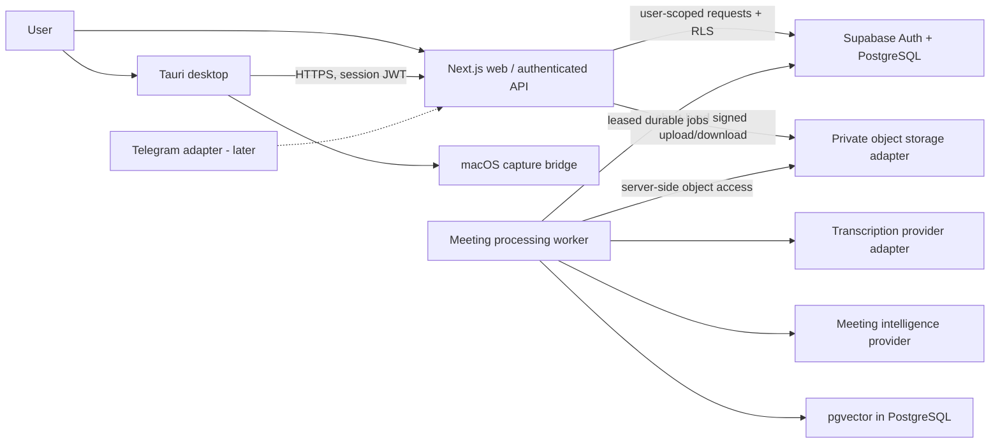

# Architecture

**Status:** Phase 1 foundation is already present in this worktree; recorder, upload, processing, and intelligence sections remain architectural proposals. This Phase 0.1 pass hardens documentation only and adds no application, migration, authentication, or worker implementation.

**Product name:** SUHBAT AI (configurable presentation name; not a domain/package constant).

**Repository name:** `tinglovchi` (retained).

## 1. Product and architecture goals

SUHBAT AI is a company meeting-memory system. The durable product record is a normalized, workspace-scoped meeting and its evidence: original audio sources, transcript segments, speakers, annotations, topics, typed intelligence, and source links. Summaries and embeddings are derived views, never replacements for source records.

The first production shape is a **modular monolith plus a separately runnable durable worker**, not a fleet of microservices:

- A Next.js web application owns the browser experience and authenticated HTTP/API boundary.
- A Tauri desktop application owns the local recording experience. Its React UI calls typed Tauri commands; Rust owns session state, local persistence, recovery, and upload orchestration. A small native macOS capture module bridges AVFoundation/CoreAudio and ScreenCaptureKit where appropriate.
- Supabase Auth and PostgreSQL are the identity and relational source of truth. PostgreSQL Row Level Security (RLS) is an authorization boundary, not a substitute for server checks.
- A worker process in the same repository claims durable database jobs and invokes storage, transcription, and AI adapters. Job execution is asynchronous and at-least-once; effects and writes must be idempotent.
- Meeting objects go through a storage interface. Use an R2/S3-compatible private object store in production and a local adapter in development. Supabase Storage is not the assumed home for large original recordings.
- Telegram is a later client/notification adapter; it is not a dependency of recording, processing, or the web product.

## 2. System context



The diagram shows planned boundaries, not deployed services. The worker and Next.js API can be deployed separately for scaling while sharing packages and a single domain model.

## 3. Target repository layout

Phase 1 has established `apps/web` and the `contracts`, `database`, `shared`, and `ui` workspaces plus Supabase migrations/tests. Desktop, Telegram, AI, transcription, storage, and worker packages remain planned boundaries and will be added only in their implementation phases.

```text
apps/
  desktop/                 # Tauri + React UI; Rust coordination; native macOS capture bridge
  web/                     # Next.js dashboard, server routes/BFF
  telegram/                # later notification/query adapter
packages/
  contracts/               # Zod request/response and normalized provider contracts
  database/                # server-only Supabase clients, generated DB types, repositories
  ai/                      # intelligence interface, OpenAI Responses adapter, prompts/schemas
  transcription/            # normalized STT interface and provider adapters
  storage/                 # private object-store interface and R2/local adapters
  shared/                  # platform-neutral domain primitives and pure utilities
  ui/                       # reusable React primitives/design system
workers/
  meeting-processing/      # durable, retryable stage handlers; no public HTTP API
supabase/
  migrations/              # canonical SQL schema, RLS, indexes, extensions
  seed.sql                 # development-only seed data, never production facts
  functions/               # only where a Supabase edge function is justified

docs/
  architecture.md
  database.md
  recording.md
  ai-pipeline.md
  security.md
  roadmap.md
```

### Package boundaries

| Boundary                     | Owns                                                                                                                              | Must not own                                                                                                               |
| ---------------------------- | --------------------------------------------------------------------------------------------------------------------------------- | -------------------------------------------------------------------------------------------------------------------------- |
| `apps/web`                   | Responsive dashboard, server-rendered pages, authenticated Server Actions (Phase 1), future versioned HTTP routes, web session UX | Provider credentials in browser code; direct object-store secrets; canonical processing logic duplicated in route handlers |
| `apps/desktop`               | Recorder UX, Tauri command surface, local session lifecycle, manifest/chunk orchestration, authenticated API client               | Supabase service-role key, OpenAI/STT credentials, business data access that bypasses the API/RLS                          |
| `packages/contracts`         | Zod schemas, stable API DTOs, enum/string unions, normalized transcript and AI result contracts                                   | Runtime secrets, provider SDKs, React, platform APIs, database connections                                                 |
| `packages/shared`            | Pure business invariants, state transition rules, time/evidence helpers shared across trusted runtimes                            | I/O, storage, network, browser globals, native platform implementations                                                    |
| `packages/database`          | Server-only Supabase/Postgres clients, generated SQL types, tenant-aware repositories and transaction boundaries                  | Browser imports, service-role use in user-request paths, provider-specific AI/transcription logic                          |
| `packages/storage`           | `ObjectStorage` port; private R2/S3 and local/dev adapters; signed transfer primitives                                            | Authorization decisions; public bucket assumptions; recording-domain state transitions                                     |
| `packages/transcription`     | `TranscriptionProvider` port, AssemblyAI adapter, normalization and provider error mapping                                        | AssemblyAI response shapes outside its adapter; business intelligence decisions                                            |
| `packages/ai`                | `MeetingIntelligenceProvider`, prompt/schema versioning, OpenAI Responses adapter, output validation                              | Direct calls from UI; unvalidated model output; free-form claims without evidence                                          |
| `packages/ui`                | Accessible, reusable React components and tokens                                                                                  | Product data fetching, authorization, recorder native state                                                                |
| `workers/meeting-processing` | Job claiming, stage orchestration, retries, redacted structured logs                                                              | Public user API, unscoped ad-hoc database access, synchronous end-to-end HTTP processing                                   |
| `supabase/`                  | Versioned PostgreSQL migrations, RLS policies, SQL functions and dev seed                                                         | Application prompts, secrets, generated local recordings                                                                   |

**Workspace tooling:** npm workspaces, Node.js 22.12+ (22.x), and npm 10 are pinned in the root manifest. The lockfile records the installed dependency graph. pnpm is not required.

## 4. Domain and data ownership

The ownership chain is `User → Workspace → Company → Project → Meeting`. A meeting has exactly one workspace and may have one company and one project. Every tenant-owned row is workspace-scoped; composite foreign keys and service-layer validation prevent a meeting from combining a project/company from another workspace. The database model and evidence joins are defined in [database.md](database.md).

The database is the source of truth for business records. Original audio objects are immutable inputs. Transcript segments retain original spoken language and canonical meeting-relative timestamps. Speaker identity is a separate mapping so renaming/mapping a diarized speaker does not rewrite transcript text. AI runs are versioned and their typed outputs link to exact transcript segment IDs. `recording.md` is authoritative for the single meeting timeline: `t=0` is the first accepted capture start on the recorder's monotonic clock; UTC wall time is a separate audit/display anchor; pause time remains on the timeline as a silent gap. Source sample maps—not file durations—resolve a canonical timestamp to playable audio. See [recording.md](recording.md), [database.md](database.md), and [ai-pipeline.md](ai-pipeline.md) for the normative timeline, persistence, and provider-normalization rules.

## 5. API and runtime boundaries

The web server is the trusted application boundary. **Phase 1** uses Next.js Server Components and Server Actions with request-scoped Supabase SSR clients; action inputs are validated with `packages/contracts` (Zod), and RLS enforces tenant scope. The web does not use a service-role key. Desktop is not implemented yet; before the desktop client is introduced, add a versioned `/api/v1` HTTP boundary using stable request/response DTOs so Tauri calls the server with the user's Supabase Auth session rather than connecting to PostgreSQL, Supabase tables, or PostgREST directly. API versioning is independent of database table names and provider response formats.

Conceptual authenticated API contracts (not implemented in Phase 1 beyond the Server Action workspace flows):

| Operation                                                                               | Contract intent                                                                                                                                                                                                           |
| --------------------------------------------------------------------------------------- | ------------------------------------------------------------------------------------------------------------------------------------------------------------------------------------------------------------------------- |
| `POST /api/v1/meetings`                                                                 | Create a meeting from validated workspace/company/project/type IDs; return a meeting DTO and server-owned authorization context.                                                                                          |
| `POST /api/v1/meetings/{meeting_id}/recordings`                                         | Start an idempotent recording session using a client-generated session ID and declared sources; return the recording ID and capture contract.                                                                             |
| `POST /api/v1/recordings/{recording_id}/chunks/{source_id}/{sequence_no}/upload-intent` | Authorize the user, bind the stable chunk identity/checksum/size, and return a short-lived single-object upload capability. Repeating the same request returns the same logical intent; conflicting metadata is rejected. |
| `POST /api/v1/recordings/{recording_id}/chunks/{source_id}/{sequence_no}/register`      | Register upload completion as provisional; the server independently verifies object key, bytes/size, and checksum before acknowledging durability.                                                                        |
| `GET /api/v1/recordings/{recording_id}/upload-status`                                   | Reconcile expected, uploaded, verified, rejected, and missing source ranges.                                                                                                                                              |
| `POST /api/v1/recordings/{recording_id}/finalize`                                       | Finalize only after the declared stop manifest is complete and every required chunk is server-verified; idempotently enqueue processing.                                                                                  |

The authenticated principal comes from the validated user's session/JWT, never from a body-supplied user or workspace ID. Requests use an `Idempotency-Key` or stable resource identity for retries and return versioned DTOs plus stable error codes. Recording bytes may go directly to a short-lived signed object URL where supported; URL issuance follows user-context membership checks. User-scoped reads/writes use the user's JWT and RLS. Any storage signer uses a narrowly scoped server-only storage credential, not a browser/desktop credential or a database service-role shortcut. Add read APIs for meeting metadata, transcript, topics, summaries, and typed intelligence, plus narrowly authorized processing retry operations using the same `/api/v1` contracts. API behavior and authorization are detailed in [security.md](security.md); the worker is internal, not a public endpoint.

Every user-facing request authenticates a user and is authorized against workspace membership. The worker's separate lease, retry, fencing, and recovery contract is in [ai-pipeline.md](ai-pipeline.md). Do not pass raw provider response objects or physical database table structures through public contracts.

## 6. Cross-cutting rules

- **One canonical meeting timeline:** all source chunks, notes, markers, normalized transcript segments, topics, evidence, and playback use half-open meeting-relative ranges. Monotonic capture time defines offsets; UTC wall time is metadata. Paused duration remains a silent interval. File duration is never the synchronization authority; see [recording.md](recording.md).
- **Evidence before assertion:** model output cites persisted segment IDs only. The server validates run/meeting ownership and derives user-visible evidence ranges from canonical segment/sample mappings; see [ai-pipeline.md](ai-pipeline.md).
- **Provider isolation:** stable internal `NormalizedTranscript` and `MeetingAnalysis` contracts sit between provider SDKs and the domain; provider-local timestamps are converted through a persisted asset-to-meeting timeline map.
- **Local-first capture:** internet outage cannot stop capture. The local manifest and independently finalized chunks are the recovery record; upload is resumable and never deletes data before verified server acknowledgement. The chunk uniqueness/idempotency contract is in [database.md](database.md).
- **Durable work:** PostgreSQL claims use transactional row locks/`SKIP LOCKED` (or equivalent), expiring owner leases and fencing tokens, bounded retries, and idempotent persistence. Crash recovery reclaims expired leases; external calls are at-least-once, not exactly-once. See [ai-pipeline.md](ai-pipeline.md).
- **Tenant scope everywhere:** `workspace_id` is carried through database rows, object keys, job records, retrieval filters, logs, and authorization checks.
- **Explicit privilege boundary:** browser and desktop UI have only user-session/public credentials; Next.js/API user operations use the authenticated user's JWT and RLS. A service-role credential, if unavoidable, is isolated to the worker runtime and audited; see [security.md](security.md).
- **Observability without transcript leakage:** use structured IDs and redacted error codes. Do not log raw audio, transcript bodies, signed URLs, or provider credentials by default.

## 7. Development and verification posture

Phase 1 adds the Next.js web shell, Zod contracts, generated-style database types, Vitest tests (including PGlite RLS tests), a gated Playwright workspace journey, ESLint, Prettier, and production build/typecheck scripts. The Playwright test requires local Supabase Auth and a browser; neither is available on the inspected host, so it is authored but not executed. PGlite does not emulate Supabase Auth/PostgREST. macOS capture remains unimplemented and must be verified on supported Mac hardware.

## 8. Deferred decisions

Before the phases that need them, verify supported macOS minimum version and Tauri/plugin choices; choose provider model identifiers and data-retention terms; benchmark audio codec/track packaging with AssemblyAI; choose a Supabase local/CI strategy; and define backup/deletion SLAs. See [roadmap.md](roadmap.md). No later-phase implementation is authorized by this document.
