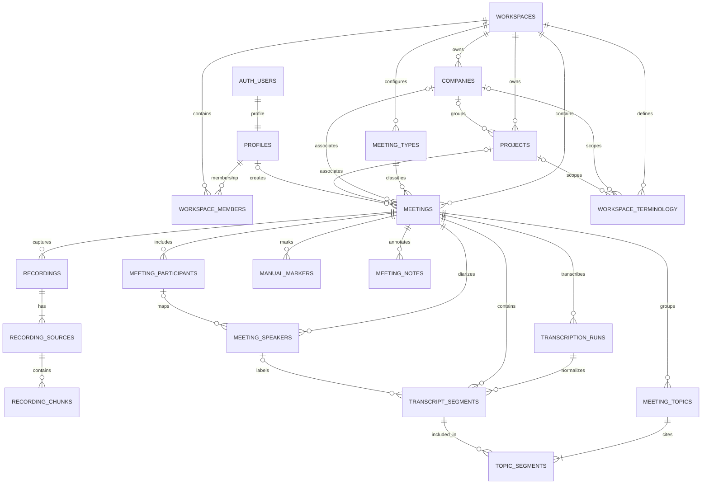

# Database model

**Status:** Phase 1 foundation migration implemented at `supabase/migrations/202610060001_phase1_foundation.sql`. Later-phase recording, transcript, AI, and memory tables remain logical design only.

**Primary store:** Supabase PostgreSQL; PostgreSQL is the source of truth for relational facts. pgvector is retrieval assistance, not authority.

## 1. Modeling rules

- UUID primary keys (`gen_random_uuid()`); `timestamptz` stored in UTC; canonical meeting-relative offsets stored as integer milliseconds. Relative offsets and UTC wall-clock timestamps are distinct fields and never substituted for one another.
- One meeting timeline is shared by source chunks, notes/markers, transcript segments, topics, evidence, and playback. Its `t=0`, monotonic clock, pause gaps, sample mapping, and provider conversion are normative in [recording.md](recording.md) and [ai-pipeline.md](ai-pipeline.md).
- Tenant-owned rows carry `workspace_id`. Child rows also carry the parent ID and use composite foreign keys such as `(meeting_id, workspace_id) → meetings(id, workspace_id)`. This supports RLS filtering and rejects cross-workspace references at the database boundary.
- Business-critical fields are relational columns. JSONB is limited to non-authoritative metadata, redacted provider payload snapshots where justified, and versioned configuration—not a whole meeting, transcript, or analysis result.
- Use database enums for deliberately small lifecycle/status domains; use workspace-scoped `meeting_types` reference rows for configurable meeting types. Meeting type keys are text/unique scoped values, **not a PostgreSQL enum**. Never let arbitrary provider strings become domain status values.
- `created_at` and `updated_at` are present on mutable entities. Immutable event/evidence rows use `created_at` without an `updated_at`. Update timestamps are maintained by a common trigger.
- Keep raw audio outside PostgreSQL. Store private object keys and verified metadata only; never store permanent signed URLs. A client upload-complete signal is provisional: only server verification of the object bytes/size/checksum makes a chunk durable.
- Use `ON DELETE RESTRICT` for core hierarchy references and controlled soft-delete/tombstone plus an explicit, retryable purge workflow for meetings. Retrieval must exclude tombstoned meetings immediately; details are in §7 and [security.md](security.md).

## 2. Entity relationship diagrams

### Workspace and meeting capture



### Intelligence, evidence, processing, and memory

```mermaid
erDiagram
  MEETINGS ||--o{ ANALYSIS_RUNS : analyzes
  ANALYSIS_RUNS ||--o{ MEETING_SUMMARIES : produces
  ANALYSIS_RUNS ||--o{ MEETING_TOPICS : produces
  MEETING_SUMMARIES ||--o{ MEETING_SUMMARY_CLAIMS : states
  MEETING_SUMMARY_CLAIMS ||--o{ SUMMARY_CLAIM_EVIDENCE : cites
  TRANSCRIPT_SEGMENTS ||--o{ SUMMARY_CLAIM_EVIDENCE : supports
  MEETINGS ||--o{ MEETING_INTELLIGENCE_ITEMS : extracts
  ANALYSIS_RUNS ||--o{ MEETING_INTELLIGENCE_ITEMS : produces
  MEETING_INTELLIGENCE_ITEMS ||--o| MEETING_DECISIONS : typed_as
  MEETING_INTELLIGENCE_ITEMS ||--o| MEETING_ACTION_ITEMS : typed_as
  MEETING_INTELLIGENCE_ITEMS ||--o| MEETING_FACTS : typed_as
  MEETING_INTELLIGENCE_ITEMS ||--o| MEETING_IDEAS : typed_as
  MEETING_INTELLIGENCE_ITEMS ||--o| MEETING_QUESTIONS : typed_as
  MEETING_INTELLIGENCE_ITEMS ||--o| MEETING_OBJECTIONS : typed_as
  MEETING_INTELLIGENCE_ITEMS ||--o| MEETING_COMMITMENTS : typed_as
  MEETING_INTELLIGENCE_ITEMS ||--o| MEETING_RISKS : typed_as
  MEETING_INTELLIGENCE_ITEMS ||--o| MEETING_FOLLOW_UPS : typed_as
  MEETING_INTELLIGENCE_ITEMS ||--o{ INTELLIGENCE_EVIDENCE : cites
  TRANSCRIPT_SEGMENTS ||--o{ INTELLIGENCE_EVIDENCE : supports
  MEETINGS ||--o{ PROCESSING_JOBS : schedules
  PROCESSING_JOBS ||--o{ PROCESSING_EVENTS : records
  WORKSPACES ||--o{ KNOWLEDGE_CHUNKS : indexes
  MEETINGS o|--o{ KNOWLEDGE_CHUNKS : sources
  KNOWLEDGE_CHUNKS ||--o{ KNOWLEDGE_CHUNK_TRANSCRIPT_SOURCES : cites
  TRANSCRIPT_SEGMENTS ||--o{ KNOWLEDGE_CHUNK_TRANSCRIPT_SOURCES : source
  KNOWLEDGE_CHUNKS ||--o{ KNOWLEDGE_CHUNK_ITEM_SOURCES : cites
  MEETING_INTELLIGENCE_ITEMS ||--o{ KNOWLEDGE_CHUNK_ITEM_SOURCES : source
  INTEGRATIONS }o--|| WORKSPACES : belongs_to
  WORKSPACES ||--o{ AUDIT_LOGS : audits
```



The diagrams omit some join columns and uniqueness rules for readability. `meeting_speakers` is intentionally separate from `meeting_participants`: speaker diarization IDs remain stable while a user can map or rename them without rewriting transcript text.

## 3. Core tables and constraints

The complete logical model below is the long-term target. The Phase 1 migration currently implements `profiles`, `workspaces`, `workspace_members`, `meeting_type_templates`, `meeting_types`, `companies`, `projects`, `meetings`, and `audit_logs`; later recording/transcript/intelligence/processing/memory tables are not yet created.

### Identity, tenant, and hierarchy

- **`profiles`** — `id` equals `auth.users.id` (delete with the auth account), display name, locale, timezone, optional avatar URL. A profile is not itself a tenant.
- **`workspaces`** — name, unique normalized slug, `created_by`, created/updated timestamps, optional `deleted_at`. Slugs are unique globally at first; workspace IDs, not slugs, authorize data access.
- **`workspace_members`** — `(workspace_id, user_id)` unique; role `owner | admin | member`; membership state `invited | active | suspended`; inviter and timestamps. Phase 1 creates only the initial active owner and does not implement invitations, suspension, or role changes. The long-term invariant is to retain an active owner and make role changes/last-owner removal transactional and audited.
- **`companies`** — `workspace_id`, name, optional description, archive timestamp. Unique composite `(id, workspace_id)` for tenant-safe references.
- **`projects`** — `workspace_id`, optional `company_id`, name, description, archive timestamp. Composite foreign keys require a company from the same workspace.
- **`meeting_type_templates` and `meeting_types`** — system templates seed the built-in keys (`general`, `client_sales`, `marketing`, `internal`, `brainstorm`, `project_planning`, `interview`). `create_workspace` copies active templates into workspace-scoped `meeting_types` in the same transaction as the workspace and first owner. `meeting_types.key` is text with `UNIQUE(workspace_id, key)`; it is deliberately **not** a PostgreSQL enum. Built-ins retain their template key; future custom types use a workspace-unique key/display name and can be deactivated without changing historical meetings. Analysis-profile references are intentionally absent from the Phase 1 migration and may be added in a later AI phase. The Phase 1 client can select a type but cannot edit templates/types. `meetings.meeting_type_id` references a type in the same workspace.
- **`workspace_terminology`** — a term, optional language/alternate spellings/context, and workspace/company/project scope. Use a constrained scope representation and tenant-safe references; do not hard-code business vocabulary in prompts or provider code.

### Meeting, recording, transcript

- **`meetings`** — `id`, `workspace_id`, nullable `company_id`/`project_id`, `meeting_type_id`, title, `status`, `processing_status`, `transcription_status`, `analysis_status`, primary/detected languages, UTC wall-clock `started_at`/`ended_at`, `timeline_version`, `timeline_origin_at` (UTC correlation anchor only), canonical `timeline_duration_ms`, separately computed `active_capture_duration_ms`, `created_by`, `current_transcription_run_id`, `current_analysis_run_id` (the accepted successful run), optional `latest_analysis_run_id` (the newest attempt, including failure), timestamps and `deleted_at`. Run pointers have same-meeting composite FKs; updating the current-analysis pointer is atomic and never mutates prior runs. The Phase 1 migration creates only `id`, `workspace_id`, nullable `company_id`/`project_id`, `meeting_type_id`, `title`, `status` (the sole value is `draft`), `created_by`, `created_at`, `updated_at`, and a trigger checking project/company compatibility. It does not create pipeline state columns (`processing_status`, `transcription_status`, `analysis_status`), run pointers, capture/language fields (`started_at`, `ended_at`, `duration_seconds`, `primary_language`, `detected_languages`), or pipeline-state enum types. Those belong in future migrations after their owning features are authorized. A `ready` meeting in later phases must have completed required pipeline stages. Archive is not deletion. The UTC wall-clock anchors are not used to calculate canonical offsets.
- **`recordings`** — `id`, meeting/workspace, client-generated `session_id` (`UNIQUE(meeting_id, session_id)`), separate capture/finalization/upload states, UTC start/stop metadata, consent receipt reference, timeline start/clock-epoch/origin mapping, non-sensitive capture metadata and retention status. The first recording establishes meeting `t=0`; later sessions must map explicitly onto that same meeting timeline. Original sources/objects are immutable after successful registration.
- **`recording_sources`** — `id`, `recording_id`, meeting/workspace, `source_kind` (`microphone`, `system_audio`, or future `mixed_rendered`), `source_role` (`original` or `derived`), required/available state, codec/container, sample rate, channels, and source clock/time mapping. A derived source records renderer/version and lineage to its exact input source/chunks; it never replaces original audio.
- **`recording_chunks`** — every canonical row carries `recording_id`, `recording_source_id`, `sequence_no`, `client_chunk_id`, `idempotency_key`, meeting-relative half-open `start_ms`/`end_ms`, playable `duration_ms`, source sample origin/count and monotonic mapping/calibration, `byte_size`, checksum algorithm/value (SHA-256 of the exact uploaded object bytes; if client-side encryption is later used, this is the ciphertext digest, with any plaintext digest stored separately and never used as the storage-verification check), storage backend/key, separate `upload_state` and `verification_state`, server `verified_at`, codec/container, sample rate/channels, and encoder trim/delay metadata when applicable. Composite FK `(recording_source_id, recording_id, workspace_id)` must prove the source belongs to that recording/meeting/workspace. `UNIQUE(recording_source_id, sequence_no)` is the primary canonical duplicate barrier; `UNIQUE(recording_id, client_chunk_id)`, `UNIQUE(recording_id, idempotency_key)`, and unique `(storage_backend, storage_key)` add request/object idempotency. The idempotency key is stable across retries and derived from recording/source/sequence. An identical retry returns the existing row; conflicting metadata or checksum is rejected, never overwritten. Sequence/ranges are ordered and non-overlapping per source; missing intervals are explicit gaps. `upload_state='uploaded'` is provisional; only the server may set `verification_state='verified'` after checking the actual stored object, expected key, byte size, and checksum. A chunk/recording is not durable/finalizable merely because the client reports upload completion.
- **`manual_markers`** — meeting/workspace, canonical `meeting_time_ms`, optional note, creator, created time. **`meeting_notes`** is separate and stores time-attached user annotation text plus the same canonical `meeting_time_ms`; neither is transcript content. These offsets use the shared monotonic meeting timeline, not UTC wall time.
- **`meeting_participants`** — named people/attendees, optional linked user profile, provenance and display order. Participants can exist without a recognized speaker.
- **`meeting_speakers`** — meeting/workspace, stable diarization `speaker_key` (e.g. `speaker_0`), display label, nullable mapped `participant_id`, mapping source. Unique `(meeting_id, speaker_key)` and same-meeting composite FK for a mapped participant.
- **`transcription_runs`** — provider, provider/model version, immutable input-asset fingerprint, persisted asset-to-meeting `timeline_map_id`/version, status, error category, start/end time and minimal raw provider metadata when needed. Provider payload and provider-local timestamps are not the canonical transcript. Normalization converts provider time through the exact input asset's piecewise map to the meeting timeline and rejects out-of-map ranges; it never assumes a file's duration or offset.
- **`transcript_segments`** — meeting/workspace, immutable transcription run/input version, nullable `speaker_key`, canonical `start_ms`, `end_ms`, original-language text, language tag, confidence, source/provider segment key, optional provider-local offsets for diagnostics, and sort index. Enforce `start_ms >= 0`, `end_ms > start_ms`; index `(meeting_id, start_ms)` and text search separately. A nullable composite FK `(meeting_id, speaker_key)` references `meeting_speakers`; create an unmapped speaker row for each recognized diarization key. Speaker-to-participant mapping can then change without rewriting transcript text. Transcript segment timestamps are persisted meeting-relative offsets suitable for playback resolution through the source/chunk timeline map.

### Topics and intelligence with evidence

- **`meeting_topics`** — meeting/workspace, analysis run, title, summary, order, keywords and derived time bounds. **`topic_segments`** is a many-to-many ordered join with composite FKs to segments in the same meeting. Topic times are derived from linked segments.
- **`analysis_runs`** — `id`, meeting/workspace, exact input `transcription_run_id`/transcript revision, provider, model, `prompt_version`, `schema_version`, pipeline/windowing version, reprocessing `generation`, `attempt_no`, optional `retry_of_run_id`, status (`queued | running | succeeded | failed | cancelled`), `started_at`, `completed_at`, and redacted error metadata. Unique `(meeting_id, generation, attempt_no)` preserves each result-producing attempt. Each run is historical: after its terminal state its metadata/results are immutable. A transient worker retry keeps the same `processing_jobs` idempotency identity but creates a new run attempt linked by `retry_of_run_id` if a provider call/result may differ; a crash before any provider effect may resume a non-terminal run under the same fencing rules. A deliberate reprocess with changed configuration increments `generation`. Reprocessing creates new run-owned output rows; it never overwrites v1 with v3. `meetings.current_analysis_run_id` points only to the accepted successful run; it changes atomically after the candidate completes validation. Optional `latest_analysis_run_id` points to the newest attempt (which may have failed) and never replaces the current accepted result by itself. Both pointers are constrained to the same meeting. Previous runs and their results remain inspectable.
- **`meeting_summaries`** — analysis run, short management-level fields such as purpose and synthesized summary. **`meeting_summary_claims`** stores individually addressable claims/outcomes; **`summary_claim_evidence`** links each claim to one or more transcript segments.
- **`meeting_intelligence_items`** — common root for typed extractions: `id`, meeting/workspace, `analysis_run_id`, `item_type`, title/description, confidence, evidence-derived start/end cache and creation time. The cache is recomputed from `intelligence_evidence`; it is not an LLM-supplied timecode or independent authority. The type-specific data is not collapsed into one JSON blob.
- **Typed one-to-one tables**: `meeting_decisions` (`proposed | tentative | confirmed | rejected | superseded`); `meeting_action_items` (open/in-progress/done/cancelled, nullable owner participant/text, nullable deadline and deadline confidence); `meeting_facts` (category, textual/numeric value and unit); `meeting_ideas`; `meeting_questions`; `meeting_objections`; `meeting_commitments`; `meeting_risks`; `meeting_follow_ups`. Each typed row has `item_id` as PK/FK and only fields meaningful to that type. A deferred constraint trigger or transaction-backed insert function enforces that the root `item_type` matches exactly one subtype table. Statuses are explicit, not inferred from table membership. Action owners and deadlines remain null unless supported by the transcript.
- **`intelligence_evidence`** — ordered relationship rows `(item_id, analysis_run_id, meeting_id, transcript_run_id, transcript_segment_id, evidence_role, ordinal)` with optional `segment_offset_start_ms`/`segment_offset_end_ms` subrange relative to the cited segment. Composite FKs prove that the intelligence item belongs to that analysis run/meeting and that the cited segment belongs to that run's exact input transcript version. Both offsets are null (whole segment) or a valid non-empty half-open subrange inside the segment; uniqueness prevents duplicate evidence links and `ordinal` preserves citation order. Summary claims use the same relationship pattern. The model returns segment IDs only—never authoritative timecodes. A typed result is not publishable without at least one valid evidence row. Displayed absolute evidence start/end are derived as `segment.start_ms + optional_offset` from persisted canonical segments; any cached item/topic bounds are recomputable and non-authoritative. Playback resolves that exact canonical point through the recording source/chunk sample map.

### Durable processing and company memory

- **`processing_jobs`** — workspace/meeting, job type/stage, generation, stable idempotency key, status, `attempt_count`/`max_attempts`, `run_after`, `lease_owner`, monotonically increasing `lease_fencing_token`, `lease_expires_at`, `heartbeat_at`, start/completion timestamps, last redacted error code and small non-sensitive parameters. `UNIQUE(idempotency_key)` prevents duplicate stage enqueue for a generation; a partial unique index permits at most one active claim per stage/generation. Claim/lease/retry/reaper behavior is normative in [ai-pipeline.md](ai-pipeline.md); execution is at-least-once.
- **`processing_events`** — append-only job/meeting/workspace lifecycle events (transition, retry, provider category, timing); exclude transcript/audio content, credentials, and signed URLs.
- **`knowledge_chunks`** — workspace plus optional company/project/meeting, chunk type (`transcript | topic | decision | fact | summary`), canonical text, time range, source version, embedding model and fixed-dimension `vector(1536)` when that embedding model is selected. Store exact model/dimension metadata. Change dimensions via a deliberate migration/re-embedding, not by silently mixing vectors.
- **`knowledge_chunk_transcript_sources`** and **`knowledge_chunk_item_sources`** — separate normalized joins from a chunk to transcript segments or typed intelligence items. Each uses a same-meeting/workspace composite foreign key and uniqueness/order constraints; there is no unchecked polymorphic source-ID array. Retrieval results resolve to relational source records and authorized meetings.
- **`integrations`** — workspace/provider/account/status and non-secret configuration metadata. OAuth tokens/secrets belong in an encrypted managed secret store, not plaintext JSONB.
- **`audit_logs`** — workspace, actor, action, target IDs, request/correlation ID, minimal redacted metadata and timestamp. Phase 1 writes successful workspace/member/company/project/meeting create events and company/project updates through `SECURITY DEFINER` triggers; names, descriptions, meeting titles, and transcript content are not copied. Authenticated clients have no direct audit-table grants or RLS policy.

## 4. Status domains

Implemented Phase 1 PostgreSQL enums:

```text
membership_role:
  owner | admin | member
membership_status:
  invited | active | suspended (only active memberships are created in Phase 1)
meeting_status:
  draft (the only Phase 1 meeting lifecycle value)
```

Future lifecycle vocabularies are design references only; they are **not** Phase 1 enums, columns, or transitions:

```text
# Future recording/processing tables and migrations
recording_capture_status: active | paused | stopped | failed | interrupted
recording_finalization_status: pending | finalizing | finalized | rejected
recording_upload_status: pending | uploading | uploaded | retryable_failed
chunk_upload_state: pending | uploading | uploaded | retryable_failed
chunk_verification_state: pending | verified | rejected
analysis_run_status: queued | running | succeeded | failed | cancelled
processing_job_status: queued | running | retryable_failed | succeeded | dead_lettered | cancelled
```

Phase 1 has no meeting pipeline status or transcription/analysis status columns. Later migrations may add pipeline state and transition rules together with their authorized capture/processing features; see [ai-pipeline.md](ai-pipeline.md) for the future design.

## 5. Indexes and integrity

Required baseline indexes include:

- Every tenant table: B-tree on `workspace_id` (often paired with its common filter/order columns).
- Phase 1 meetings: `(workspace_id, created_at DESC)`, `(workspace_id, status, updated_at DESC)`, and optional company/project filters paired with `created_at`. Add start-time indexes only with a later migration that introduces canonical meeting/capture timestamps.
- Memberships: unique `(workspace_id, user_id)` and `(user_id, membership_status)`.
- Recording chunks: unique source/sequence and recording/idempotency key; partial indexes for pending/uploading/unverified chunks; lookup by `(storage_backend, storage_key)` unique.
- Transcript segments: `(meeting_id, start_ms, segment_order)`; full-text index on text only after language/search behavior is selected.
- Intelligence items: `(meeting_id, item_type, created_at)`; evidence joins indexed in both directions.
- Jobs: partial index on queued/retryable rows by `run_after`, plus lease-expiry index for abandoned workers.
- Knowledge: tenant/filter B-trees plus pgvector index chosen after measuring corpus size and recall. Every vector query must add an authorized workspace predicate before ranking.

Use composite foreign keys/unique keys for workspace consistency. Where SQL constraints cannot express a rule (for example company/project compatibility or “at least one evidence link”), enforce it in a transaction-backed domain function and test it against PostgreSQL. Do not rely on a UI filter.

## 6. RLS and query rules

Enable RLS on every client-accessible tenant table. User-path queries run with a session-bound Supabase client, not the service-role key. A representative policy condition is:

```sql
exists (
  select 1
  from public.workspace_members wm
  where wm.workspace_id = row.workspace_id
    and wm.user_id = auth.uid()
    and wm.membership_status = 'active'
)
```

The Phase 1 migration implements this explicit authorization matrix:

| Operation                                                        | Owner                      | Admin                      | Member              |
| ---------------------------------------------------------------- | -------------------------- | -------------------------- | ------------------- |
| Read workspace, companies, projects, meeting types, and meetings | Active membership          | Active membership          | Active membership   |
| Create/update companies and projects                             | Allowed                    | Allowed                    | Denied              |
| Delete companies or projects                                     | Denied                     | Denied                     | Denied              |
| Create a meeting draft                                           | Allowed                    | Allowed                    | Allowed             |
| Change meeting lifecycle or create a non-draft meeting           | Denied                     | Denied                     | Denied              |
| Read membership rows                                             | Own membership only        | Own membership only        | Own membership only |
| Invite users or change membership roles                          | Not implemented in Phase 1 | Not implemented in Phase 1 | Not allowed         |

Function privileges are equally narrow: `create_workspace` is revoked from `public` and granted only to `authenticated`, and the trigger-only functions (`set_updated_at`, `validate_meeting_project_company`, `write_workspace_audit_log`) are revoked from `public`/`anon` and granted to `authenticated` because table writes execute them. `handle_new_user()` keeps its default grant since the Supabase Auth admin role must execute it from the `auth.users` insert trigger.

Any authenticated user may create a workspace through `create_workspace`; the function atomically assigns that user the initial active `owner` role. The server actions check active membership/role for user feedback, while RLS remains the database enforcement boundary. There is no client policy for membership writes or owner/admin role changes. Later membership management must use a non-recursive, narrowly scoped operation with fixed `search_path`, minimal grants, audit coverage, and no caller-selected identity; never expose a definer helper that accepts arbitrary user IDs as an authorization oracle.

A worker may require trusted system privileges to claim jobs and access tenant objects. Keep those credentials in the worker only, use a dedicated runtime identity/limited database grants where feasible, validate `job_id → meeting_id → workspace_id` on every stage, and include explicit workspace predicates on all reads/writes. This worker trust boundary does not weaken user-facing RLS; details and residual risk are in [security.md](security.md).

## 7. Deletion and retention

Deletion is a durable lifecycle, not a single `DELETE` that stops at the meeting row:

1. In one PostgreSQL transaction, set the meeting tombstone/deletion state, block ordinary reads, and write an idempotent purge job/outbox event. Transcript search, Ask AI/vector retrieval, signed-media issuance, and worker stage selection must immediately filter out tombstoned meetings, so no knowledge chunk/embedding remains **searchable** during asynchronous physical purge.
2. Cancel or fence queued/running processing jobs and reject new writes for that meeting. Record each purge stage/object in a durable deletion ledger with opaque key/version, attempts, state, and last redacted error.
3. Purge/reconcile the dependency graph: recording sources/chunks and original/mixed audio objects; transcript runs/segments/speakers; notes/markers/participants; topics and topic joins; analysis runs/summaries/claims/typed intelligence/evidence; knowledge chunks and embedding/vector rows; provider artifacts, exports, caches and derived files. Remove relational source rows only after dependent references are handled under explicit FK order/policy.
4. Delete each object using its exact storage backend/key/version and retain the ledger entry until the store confirms deletion or confirms the object is already absent. Retry transient failures with bounded backoff; run a periodic prefix/manifest reconciliation for orphaned objects. A failed object deletion remains `purge_pending`/visible and alertable—it is never silently marked complete or forgotten.
5. Mark the meeting `purged` only when all primary database rows, search/vector rows, and required object deletions are confirmed. Signed URLs already issued may survive until their short expiry, so tombstone blocks new URLs immediately and retention policy accounts for outstanding capabilities.

Backups have a documented expiry window; “deleted” from the application is not a promise of immediate physical removal from immutable backups. Legal holds pause only the explicitly held portion and are audited. Recording retention is configurable later; local chunks are not removed before remote integrity acknowledgement and retention rules permit removal. The authorization/operational workflow is cross-referenced in [security.md](security.md).

## 8. Phase boundary

Phase 1 implements the identity/workspace/company/project/meeting foundation, default meeting-type provisioning, audit events, and RLS in `supabase/migrations/202610060001_phase1_foundation.sql`. PGlite tests apply that migration with a minimal `auth` schema and verify policies/constraints. This is not a substitute for applying it through Supabase CLI or testing Auth/PostgREST on a real Supabase instance. Recording, transcript, AI, vector, integration, and deletion tables remain logical design only and should be added with their implementation phases.
